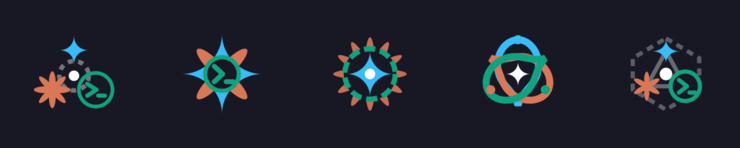

# Agent Hub Plugin Icon Concepts

This directory contains 5 conceptual icon designs that synthesize the visual signatures of the three pair-programming AI agents monitored by Agent Hub:
- **Claude Code**: Warm coral sunburst / radial asterism (`#D97757`)
- **Google Antigravity**: Celestial 4-point curved diamond sparkle (`#38BDF8`)
- **OpenAI Codex**: Emerald terminal badge & command prompt `> _` (`#10A37F`)

---

## Visual Overview

### Full Color Strip

### Monochrome Bar White

---

## The 5 Options

| Option | Concept | Color SVG | Monochrome SVG |
| :--- | :--- | :--- | :--- |
| **Option 1: Trinity Convergence** | 120° Triad crest connecting all three individual agent marks around an orbital nexus | [`option1_trinity_convergence.svg`](option1_trinity_convergence.svg) | [`option1_mono.svg`](option1_mono.svg) |
| **Option 2: Hybrid Starburst** ⭐ | Unified fusion glyph combining Antigravity cardinal diamond flares, Claude diagonal petals, and Codex prompt core | [`option2_hybrid_starburst.svg`](option2_hybrid_starburst.svg) | [`option2_mono.svg`](option2_mono.svg) |
| **Option 3: Concentric Portal** | Concentric layering: Claude 12-petal crown outside, Codex rosette ring in the middle, Antigravity star core inside | [`option3_concentric_portal.svg`](option3_concentric_portal.svg) | [`option3_mono.svg`](option3_mono.svg) |
| **Option 4: Triquetra Knot** | Three interlocking ribbon loops in cyan, coral, and emerald framing an interior diamond star | [`option4_triquetra_shield.svg`](option4_triquetra_shield.svg) | [`option4_mono.svg`](option4_mono.svg) |
| **Option 5: Hex Constellation** | Cybernetic hexagonal network truss connecting the three agent cores | [`option5_terminal_nexus.svg`](option5_terminal_nexus.svg) | [`option5_mono.svg`](option5_mono.svg) |
